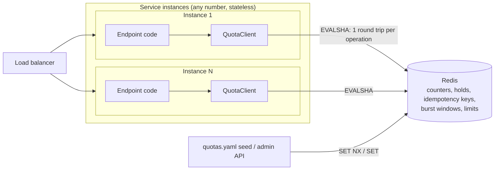
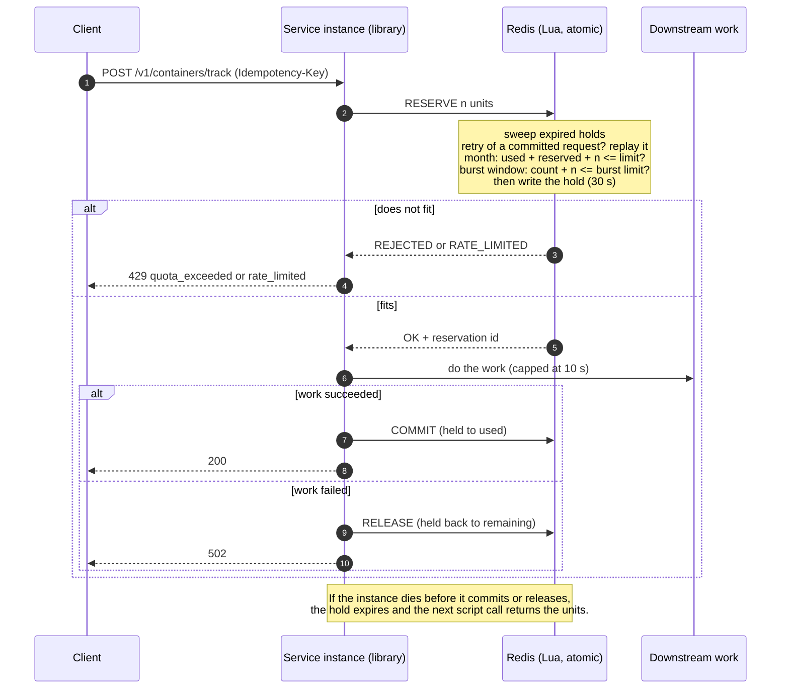
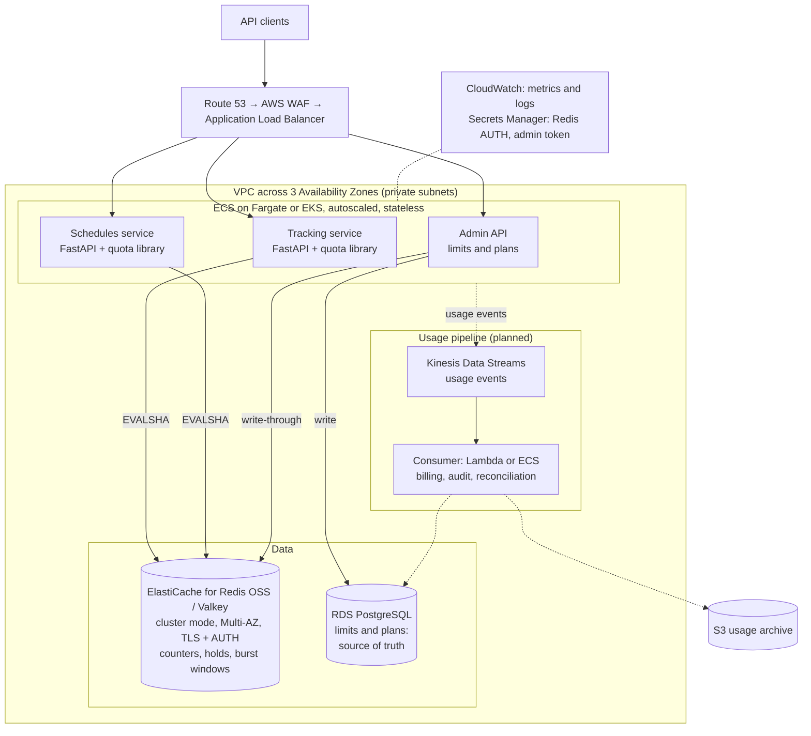

# Quota Metering

Per-customer, per-feature monthly quota metering in Python 3.12, backed by Redis and embedded
as an async library in a FastAPI service. Each metered request reserves units, does its work,
then commits or releases them. The counter never exceeds its limit and never goes negative,
even when many requests hit it at once from several service instances. Work can't outlive
its hold in the demo service, so the work served stays within the limit too. The one known
gap is a hard Redis crash, which can lose about 1 s of deductions (see DESIGN.md).

## Quick start

Requires Docker with Compose v2. Starting from nothing? See
[Running on a new machine](#running-on-a-new-machine).

```bash
make load    # builds and starts Redis + 3 API replicas + nginx, then runs a 60 s HTTP load test
make down    # stops the stack and deletes its data
```

`make load` prints one JSON report. The run **passes** if the command exits 0 and the report
shows `"over_limit_orgs": 0` and `"granted_vs_used_mismatches": 0`. If either is non-zero, it
prints `AUDIT FAILED` and exits non-zero. Some `502` responses are expected: the demo
simulates a 5% downstream failure rate (`DOWNSTREAM_FAILURE_RATE`), and those holds are
released. The stack stays up on http://localhost:8080 until `make down`.

The audit compares what clients were granted with the growth in `used` during the run (it
snapshots usage first), so repeated runs pass without a reset. Usage does pile up within
the month, though: after a few runs most orgs are at their limit and nearly every request
is a `429 quota_exceeded`. Run `make down` first to measure the grant path.

## Running on a new machine

Every step below was run on a fresh clone from GitHub on 5 October 2026.

### 1. Install the prerequisites

| Tool | Needed for | macOS | Ubuntu / Debian | Windows |
|---|---|---|---|---|
| Git | cloning | `xcode-select --install` | `sudo apt install git` | Use WSL2 (Ubuntu) and follow the Ubuntu column |
| Docker with Compose v2 | everything | [Docker Desktop](https://docs.docker.com/desktop/) | [Docker Engine](https://docs.docker.com/engine/install/ubuntu/) + `docker-compose-plugin`; add yourself to the `docker` group | Docker Desktop with the WSL2 backend |
| make | the `make` shortcuts | included with `xcode-select --install` | `sudo apt install make` | inside WSL2: `sudo apt install make` |
| Python **3.12** | only tests and checks on the host | `brew install python@3.12` | `sudo apt install python3.12 python3.12-venv` (on older releases, via the deadsnakes PPA) | inside WSL2, as Ubuntu |

Check them:

```bash
git --version
docker compose version   # must say v2.x; the old "docker-compose" (v1) will not work
make --version
python3.12 --version     # only for step 4
```

Before you start:
- **Start Docker** (Docker Desktop must be running).
- **Give Docker at least 4 CPUs and 4 GB of memory** (Docker Desktop → Settings → Resources).
  The load test runs Redis, 3 API replicas, nginx and the load generator together.
- **Free ports 6379 (Redis) and 8080 (the API)**. A local `redis-server` already on 6379 is
  the usual clash; stop it (`brew services stop redis` or `sudo systemctl stop redis`).
- Both Intel and Apple Silicon (arm64) work; all images are multi-arch.

### 2. Clone

```bash
git clone https://github.com/naveen-singh-rathore/portcast-assesment.git
cd portcast-assesment
```

### 3. Run the whole stack (Docker only, no Python needed)

```bash
make load   # first run downloads images and builds: allow a few minutes
```

It passes if it exits 0 and the report shows `"over_limit_orgs": 0` and
`"granted_vs_used_mismatches": 0` (see [Quick start](#quick-start)). The stack stays up on
http://localhost:8080, so you can try the API by hand:

```bash
# Health, and which replica answered
curl -s localhost:8080/healthz

# Track 2 containers for org-0042 (1 unit each)
curl -s -X POST localhost:8080/v1/containers/track \
  -H 'Content-Type: application/json' -H 'Idempotency-Key: demo-1' \
  -d '{"org":"org-0042","containers":["MSCU1234567","MAEU7654321"]}'

# Same key, same body: replayed, not charged again ("replayed": true)
curl -s -X POST localhost:8080/v1/containers/track \
  -H 'Content-Type: application/json' -H 'Idempotency-Key: demo-1' \
  -d '{"org":"org-0042","containers":["MSCU1234567","MAEU7654321"]}'

# Monthly usage plus the current burst window
curl -s localhost:8080/v1/quota/org-0042/container-tracking

# Lower the burst limit to 3 units per 60 s, then send two batches of 2:
# the first gets 200, the second 429 rate_limited with a Retry-After header
curl -s -X PUT localhost:8080/v1/quota/org-0042/container-tracking/burst \
  -H 'Content-Type: application/json' -d '{"units":3,"window_s":60}'
for i in 1 2; do
  curl -s -i -X POST localhost:8080/v1/containers/track \
    -H 'Content-Type: application/json' -d '{"org":"org-0042","containers":["A","B"]}'
  echo
done
```

Interactive API docs (FastAPI) are at http://localhost:8080/docs. Library benchmark:
`make bench`. When you are done:

```bash
make down   # stops everything and deletes the Redis data
```

### 4. Run the tests and checks on the host (optional)

```bash
python3.12 -m venv .venv          # use python3.12 explicitly: plain python3 may be older
source .venv/bin/activate
pip install -r requirements.txt -r requirements-dev.txt
make redis-up                     # Redis 7.4 in Docker on localhost:6379
make check                        # black, ruff, mypy, pytest: the same checks as CI
make redis-down                   # when finished
```

`make check` should end with `109 passed`. The tests use Redis DB 15 and **flush it**.

### Without make

Each target is one or two plain commands (see [Makefile](Makefile)):

| make | Equivalent |
|---|---|
| `make load` | `docker compose up --build -d --wait`, `docker compose --profile load build loadgen`, then `docker compose --profile load run --rm --no-deps loadgen` |
| `make bench` | `docker compose up -d --wait redis`, then `docker compose --profile bench run --rm --build bench` |
| `make redis-up` | `docker compose up -d --wait redis` |
| `make check` | `black --check . && ruff check . && mypy . && pytest` |
| `make down` | `docker compose down -v` |

### Troubleshooting

| Symptom | Cause and fix |
|---|---|
| `port is already allocated` / `address already in use` | Something else holds 6379 or 8080. Stop it, or a stack from another checkout: `docker ps`, then `docker compose down -v` in that folder |
| `Cannot connect to the Docker daemon` | Docker is not running. Start Docker Desktop (or `sudo systemctl start docker`) |
| `permission denied ... docker.sock` (Linux) | `sudo usermod -aG docker $USER`, then log out and back in |
| `unknown flag: --wait` or `docker-compose: command not found` | Compose v1 or an old v2. Install Compose v2.1 or later; the command is `docker compose` |
| Every request is `429 quota_exceeded` | Repeated `make load` runs used up this month's quota. `make down`, then run again |
| `pip` fails on a dependency, or mypy/pytest import errors | The venv is not Python 3.12. Delete `.venv` and recreate it with `python3.12 -m venv .venv` |
| Tests fail with `Connection refused` | Redis is not up: `make redis-up` |
| Load test far below 250 req/s or slow p99 | Docker has too few CPUs, or the machine is busy. Numbers are machine-dependent; the audit result is what must pass |

## Running tests

```bash
make redis-up   # Redis 7.4 in Docker on localhost:6379
make test       # pytest on the host; expect 109 passed
```

Without Docker: start any Redis on port 6379 (`redis-server`), then run `pytest`. Tests use
`REDIS_URL` (default `redis://localhost:6379/15`) and **flush that DB**, so never point it at
real data. `make check` runs black, ruff, mypy and pytest, the same checks CI runs.

`tests/test_concurrency.py` starts 8 OS processes with 50 concurrent requests each against one
counter, and checks that no more than the limit is ever granted. Its control test runs the
same load against a naive GET-then-INCRBY version and **requires** that version to
over-serve. That proves the harness really creates contention.

## Benchmarks

```bash
make bench   # library only: 4 processes x 32 concurrent loops, 5,000 orgs, 20 s (Redis DB 14, flushed first)
```

It prints JSON with `throughput_ops_s`, `latency_ms` (p50/p95/p99/max/mean),
`rejected_requests`, `orgs_touched` and `invariant_violations`. For every org touched it checks
`granted == used <= limit` and `reserved == 0`, and exits non-zero (`INVARIANT VIOLATED`) if
any org fails. To run it without Docker: `python -m loadtest.bench --procs 4 --conc 64 --seconds 15`.
Measured numbers are under [Results](#results).

## Results

Measured on 4 October 2026 on an Apple M3 laptop (8 cores, 8 GB RAM) with Docker Desktop
limited to 8 CPUs and 4 GB. Redis, the 3 replicas, nginx and the load generators all ran on
that one machine. Your numbers will differ; the audits should still pass.
[DESIGN.md](DESIGN.md#load-test) is the main record, along with what these numbers mean
for limits.

| Run | Result |
|---|---|
| `make check` | 78 tests passed (109 with the burst limit, 5 October 2026) |
| Concurrency control (`tests/test_concurrency.py`, 3 runs) | Naive GET-then-INCRBY used 818, 1,633 and 1,418 units on a limit of 500. The Lua-backed tests stayed at or under the limit in every run |
| `make bench` (4 processes x 32 loops, 5,000 orgs, 20 s) | 53,707 quota ops/s; latency p50 2.278 ms, p95 3.758 ms, p99 4.822 ms; **0 invariant violations** across 4,985 orgs. No org reached its limit, so this measures the grant path |
| `make load` (3 replicas, target 300 req/s, 60 s) | 15,056 requests at 251 req/s achieved. Quota overhead p50 0.563 ms, p99 1.161 ms; end to end p50 9.34 ms, p99 14.78 ms. Status codes: 200: 14,290, 502: 713 (simulated failures), 429: 53. **Audit passed:** 0 orgs over their limit and 0 mismatches across 200 orgs |
| `make load` with burst limits (300 units/s per org; 100 for org-0001), 5 October 2026, fresh stack | 15,073 requests at 251 req/s. Quota overhead p50 0.569 ms, p99 2.557 ms; end to end p50 9.41 ms, p99 18.25 ms. Status codes: 200: 13,924, 502: 704, 429: 445 (432 `rate_limited`, 13 `quota_exceeded`). **Audit passed:** 0 over-limit, 0 mismatches across 200 orgs. The laptop was busier than on 4 October (load average ~7 on 8 cores), which shows in the tail latency; see [DESIGN.md](DESIGN.md#burst-limit-fixed-window-per-org-feature) for the A/B cost of the burst check |
| `make load` with faults: one API replica killed at 15 s, Redis restarted at 30 s | 14,496 requests; 109 fast 503s while Redis restarted (fail closed); the other two replicas took the killed one's traffic. **Audit passed:** 0 over-limit, 0 mismatches |
| Redis `INFO commandstats` | 13.71 µs per `EVALSHA`, so one Redis node tops out at about 73,000 quota ops/s (computed, not measured) |

## Architecture

The quota system is a **library**, not a service. Every service instance that sells metered
features imports `QuotaClient` and talks straight to a shared Redis. All correctness comes
from one place: each quota operation is a single Lua script that Redis runs atomically. The
service instances share nothing else, so you can add, kill or restart them freely.

### Components



Inside the library ([quota/](quota/)):

| Module | Responsibility |
|---|---|
| [client.py](quota/client.py) | Public API: `reserve`, `consume`, `commit`, `release`, `extend`, `usage`, `hold()`, `set_limit`, `set_burst_limit`. Maps script results to typed errors, retries the operations that are safe to repeat, resolves month disagreements with Redis |
| [scripts.py](quota/scripts.py) | The Lua scripts. Each one sweeps expired holds, checks, and writes, with nothing able to run in between |
| [keys.py](quota/keys.py) | Key layout and identifier validation. Every key for one (org, feature) shares the hash tag `{org:feature}` |
| [periods.py](quota/periods.py) | Billing periods: calendar months in UTC |
| [errors.py](quota/errors.py) | Typed errors the caller maps to its own responses (`QuotaExceeded`, `RateLimited`, `QuotaUnavailable`, ...) |

### How a request is metered



- Each service instance embeds `QuotaClient` and talks to Redis directly; there is no separate
  quota service: [quota/client.py](quota/client.py).
- Every operation (reserve/consume, commit, release, usage) is one Lua script, so the check
  and the write happen together with nothing in between: [quota/scripts.py](quota/scripts.py).
- `reserve` holds units for 30 s, then `commit` charges them or `release` returns them. Holds
  that are never resolved expire, and the next script call on that counter clears them.
- An `Idempotency-Key` maps a retry to the original reservation and a fingerprint of the
  request, so a retry after a commit is not charged again, and the same key can't be reused
  for a different request.
- Hold expiry and the billing month use the Redis server clock, so an instance with a wrong
  clock can't expire other instances' holds or bill the wrong month.
- Periods are calendar months in UTC ([quota/periods.py](quota/periods.py)). The period id is
  part of every counter key, so a new month starts on fresh keys and no reset job is needed:
  [quota/keys.py](quota/keys.py).
- An optional **burst limit** caps how fast an org can spend its quota: at most N units per
  fixed window (e.g. 300 per second). It is checked in the same script as the monthly limit,
  so a request is admitted only if it fits both. See [DESIGN.md](DESIGN.md#burst-limit-fixed-window-per-org-feature).
- All keys for one (org, feature) share the hash tag `{org:feature}`, so scripts also work on
  Redis Cluster.

Redis data per (org, feature), all under the hash tag `{org:feature}`:

| Key | Type | Holds | Lifetime |
|---|---|---|---|
| `q:{org:feat}:limit` | string | monthly limit | until changed |
| `q:{org:feat}:burst` | string | `units/window_ms` | until changed or removed |
| `q:{org:feat}:YYYY-MM` | hash | `used`, `reserved` | the month + 35 days |
| `q:{org:feat}:YYYY-MM:res` / `:resunits` / `:done` | zset / hash / hash | live holds, their units, and their outcome (committed, released, expired) | the month + 35 days |
| `q:{org:feat}:win` | hash | current burst window start and count | until the window ends |
| `q:{org:feat}:idem:<key>` | string | reservation id, units, request fingerprint | 1 hour |

### Why a library

The hard requirement is that a counter shared by many instances never over-serves. That
correctness comes from Redis running each script atomically, not from where the calling
code runs. So the question was only how the calling code reaches Redis:

| Option | Extra network hops per request | Verdict |
|---|---|---|
| **In-process library + shared Redis (chosen)** | 0 (service to Redis only) | Lowest latency (quota overhead p50 0.57 ms in the load test), no extra fleet to run or scale, and nothing new that can fail apart from Redis itself |
| Central quota microservice | +1 (service to quota service to Redis) | Language-neutral, but adds a hop, a fleet to operate, and a new failure point, with no gain in correctness |
| Sidecar per pod (e.g. Envoy rate limit service) | +1 local hop | Language-neutral, but a container per pod and generic rate limiting only: no reserve, commit or release around downstream work |
| API gateway quotas (e.g. AWS API Gateway usage plans) | 0 | Built in, but AWS documents usage-plan quotas as best effort, not hard limits; they count requests, not units per batch, and cannot return quota when downstream work fails |

What the library costs, and how to change course if that cost grows:
- **Consumers must be Python.** The Lua scripts are language-neutral, so a Go or Node service
  needs only a thin port of `client.py`. If many languages need it, wrap the same scripts in a
  small gRPC service: the scripts move unchanged.
- **Upgrades roll out with each service.** During a rolling deploy, old and new instances run
  side by side. Each loads its own script version, so a new rule (such as the burst limit)
  applies only on upgraded instances until the rollout finishes. Counters stay correct
  throughout: every version checks the monthly limit.

### Constraints

| Constraint | Effect | Mitigation |
|---|---|---|
| Redis is on every metered request | Redis down means `503` (fail closed) | Per-feature fail-open (`FAIL_OPEN_FEATURES`); Multi-AZ replicas with automatic failover |
| AOF `everysec` persistence | A hard Redis crash can lose about 1 s of deductions, so it can over-serve by that much | A durable store (e.g. Amazon MemoryDB) or reconciliation from a usage-event log |
| One Redis primary runs scripts serially | About 73,000 quota ops/s per node (computed from 13.71 µs per script) | Redis Cluster: keys are already hash-tagged per (org, feature) |
| One (org, feature) lives on one slot | A single hot counter cannot be split across nodes | Fine for per-org traffic; very hot orgs would need pre-split sub-quotas |
| Fixed burst windows | Up to 2× the burst limit across a window boundary | A sliding window counter, in the same script, if it matters |
| Idempotency keys live 1 hour, outside the month keys | Older retries, or retries across a month boundary, are treated as new requests | Longer TTL at a memory cost (DESIGN.md has the sizing) |
| Limits live in Redis in the demo | No audit history of limit changes | Postgres as the source of truth, written through to Redis |

DESIGN.md has the full reasoning, the options that were rejected, and the measurements.

### Deploying on AWS

A proposed production layout. The repo runs this shape locally with Docker Compose (nginx in
place of the ALB, one Redis container in place of ElastiCache); the AWS version has not been
built or tested.



Dashed lines are planned parts that this repo does not include yet.

How each piece maps to the code, and what would change:

- **Compute (ECS on Fargate or EKS).** Each service task embeds the library, as the
  Compose replicas do today. Tasks are stateless, so they scale out on CPU or request count
  without coordination.
- **ElastiCache for Redis OSS or Valkey** replaces the Redis container. Point `REDIS_URL` at it
  with `rediss://` for TLS. For cluster mode, create the client as `RedisCluster` instead of
  `Redis`: the keys are already hash-tagged, so every script touches a single slot. This
  change is small but has not been tested against a cluster yet.
- **Amazon MemoryDB** is the alternative when the 1 s crash window is not acceptable: it
  writes to a Multi-AZ transaction log before acknowledging, at the cost of slower writes.
- **RDS PostgreSQL** becomes the source of truth for limits and plans; the admin API writes
  there and through to Redis, replacing `quotas.yaml` seeding.
- **Kinesis, a consumer and S3** carry usage events for billing, audit, and reconciling
  Redis after a failover. This is the main piece still to build (see DESIGN.md, "Getting to
  50,000 orgs").
- **CloudWatch** collects per-script latency, rejection rate (`quota_exceeded` vs
  `rate_limited`), expired holds and fail-open count. **Secrets Manager** holds the Redis
  AUTH token and `ADMIN_TOKEN`.
- **Sizing.** One shard handles about 73,000 quota ops/s (computed). 50,000 orgs is about
  1.5 million counters, a few hundred MB. A 3-shard cluster with one replica per shard
  leaves wide headroom.

## API

Served by [service/app.py](service/app.py). Through nginx, it's on http://localhost:8080.

| Method | Path | Metered | Status codes |
|---|---|---|---|
| POST | `/v1/containers/track` | Yes: 1 unit per container; reserve, then commit or release | 200, 400, 403, 409, 422, 429, 502, 503 |
| GET | `/v1/schedules/search?org=` | Yes: 1 unit, one-shot `consume()` | 200, 400, 403, 422, 429, 503 |
| GET | `/v1/quota/{org}/{feature}` | No: usage for the current month, and the burst window if one is set | 200, 400, 403, 503 |
| PUT | `/v1/quota/{org}/{feature}` | No: set the limit, body `{"limit": n}` | 200, 400, 401, 422, 503 |
| PUT | `/v1/quota/{org}/{feature}/burst` | No: set the burst limit, body `{"units": n, "window_s": s}` | 200, 400, 401, 403, 422, 503 |
| DELETE | `/v1/quota/{org}/{feature}/burst` | No: remove the burst limit | 200, 400, 401, 403, 503 |
| GET | `/healthz` | No | 200, 503 |

What each code means:
- `400`: invalid org or feature id.
- `401`: `ADMIN_TOKEN` is set and the request lacks `Authorization: Bearer <token>`.
- `403`: no limit is configured for this org and feature.
- `409`: the same `Idempotency-Key` is still in progress. Comes with `Retry-After: 1`.
- `422`: the request fails validation, or (`idempotency_key_reused`) the same
  `Idempotency-Key` was used before with a different body.
- `429`: not enough quota (`quota_exceeded`), or the burst window is full (`rate_limited`,
  with `Retry-After` until the window resets). Batches are all-or-nothing. A batch larger
  than the whole window gets no `Retry-After`: split it.
- `502`: the downstream work failed or took longer than `DOWNSTREAM_TIMEOUT_S`, and the
  reserved quota was returned.
- `503`: Redis is unreachable.

A retry of a committed `/track` request returns `200` with `"replayed": true`. `/track`
responses with status 200 or 502 carry the `X-Quota-Ms` and `X-Instance` headers.

## Using the library in another service

```python
from redis.asyncio import Redis
from quota import QuotaClient

quota = QuotaClient(Redis.from_url("redis://localhost:6379/0"))

async def track(org: str, containers: list[str], request_id: str) -> None:
    async with quota.hold(org, "container-tracking", len(containers), request_id) as res:
        if res.status == "DUPLICATE":
            return  # committed by an earlier attempt: don't redo the work
        await do_tracking(containers)  # returns normally -> commit; raises -> release
```

`hold()` raises these errors:
- `QuotaExceeded`: not enough quota. It carries `remaining`.
- `RateLimited`: the burst window is full. It carries `burst_limit` and `retry_after_s`
  (`None` if the batch can never fit a window). Set limits with
  `quota.set_burst_limit(org, feature, units, timedelta(seconds=1))`.
- `QuotaNotConfigured`: no limit is set.
- `DuplicateInFlight`: the same key is still being processed.
- `IdempotencyKeyReused`: the key was used before with a different request. Pass a
  `fingerprint` that identifies your request body; the default is the unit count.
- `QuotaUnavailable`: Redis is unreachable. The caller decides whether to fail open or closed.
- `HoldExpired`: raised after the block, when the work outlived its 30 s hold and the capacity
  went to others, so it was not charged. Call `quota.extend(res.reservation)` during long
  work to keep the hold alive.

## Configuration

| Variable | Read by | Default | Purpose |
|---|---|---|---|
| `REDIS_URL` | service | `redis://localhost:6379/0` | Redis to use; compose sets `redis://redis:6379/0` |
| `SEED_FILE` | service | unset (no seeding) | Path to `quotas.yaml`; compose sets `/app/quotas.yaml` |
| `FAIL_OPEN_FEATURES` | service | empty | Comma-separated features that serve unmetered when Redis is down, instead of returning 503 |
| `DOWNSTREAM_FAILURE_RATE` | service | `0.05` | Share of simulated downstream failures in `/track` |
| `DOWNSTREAM_TIMEOUT_S` | service | `10` | Downstream time limit in `/track`; must leave 5 s of the 30 s hold, or the service won't start |
| `ADMIN_TOKEN` | service | empty (open) | If set, `PUT /v1/quota/...` requires `Authorization: Bearer <token>` |
| `HOSTNAME` | service | `local` | Instance id returned in `X-Instance` and `/healthz`; set by Docker |
| `REDIS_URL` | tests / bench | `.../15` / `.../14` | Database that tests and bench **flush** |

**How limits are seeded:** [quotas.yaml](quotas.yaml) sets a `default` limit per feature,
generates orgs `org-0001` to `org-NNNN` from `orgs.count`, and applies per-org `overrides`.
At startup the service checks that every limit is an integer >= 0, and fails to start
otherwise. It then writes each limit with `SET NX`. A restart therefore never overwrites a
limit that was changed later through `PUT /v1/quota/{org}/{feature}`. The optional `burst:`
section works the same way (`default` per feature plus per-org `overrides`, each
`{units, window_s}`), and is seeded with `SET NX` too.

## Development

```bash
python3.12 -m venv .venv && source .venv/bin/activate
pip install -r requirements.txt   # runtime deps (redis, fastapi, ...); the tests import them
make install-dev   # dev tools + the git pre-commit hook (black, ruff, mypy, file checks)
make format        # auto-fix lint issues and reformat
make check         # what CI runs (.github/workflows/ci.yml), with tests against Redis 7.4
```

## Repository layout

```
quota/              the library
  periods.py        calendar-month UTC periods
  keys.py           Redis key layout and identifier validation
  scripts.py        Lua scripts: reserve/consume (monthly + burst window), commit, release, extend, usage
  client.py         async QuotaClient, hold(), extend()
  errors.py         error types
service/app.py      FastAPI demo service that uses the library
loadtest/
  bench.py          library benchmark with invariant audit
  loadgen.py        HTTP load generator with client/Redis audit
tests/              109 tests (unit, real Redis, multi-process, HTTP, audit logic)
quotas.yaml         seed limits
docker-compose.yml  Redis, 3 API replicas, nginx; loadgen/bench under profiles
Dockerfile          multi-stage: api and loadtest images
nginx.conf          round-robin across the API replicas; re-resolves them every 5 s
Makefile            up, down, load, bench, redis-up, test, check
DESIGN.md           decisions, measured numbers, limits
```

## Further reading

[DESIGN.md](DESIGN.md) explains why the system is built this way. It covers the options that
were rejected, the concurrency proof, measured load-test numbers, where it falls over, and
what would change to reach 50,000 orgs.

[AI_USAGE.md](AI_USAGE.md) says how AI was used to build this, who decided what, how the
AI's output was checked, and what it got wrong.
